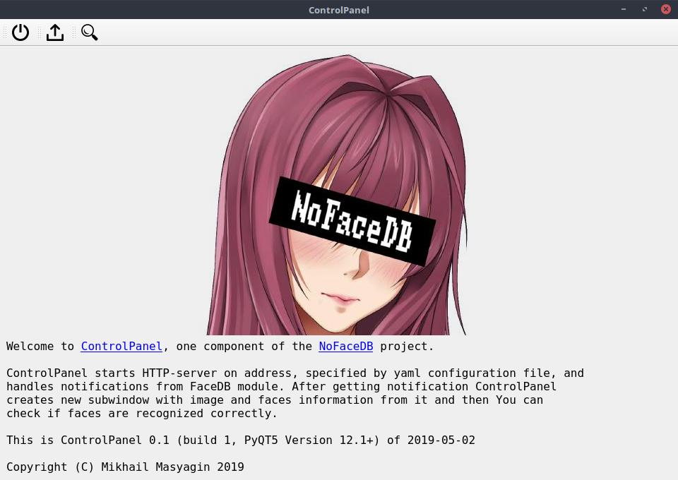
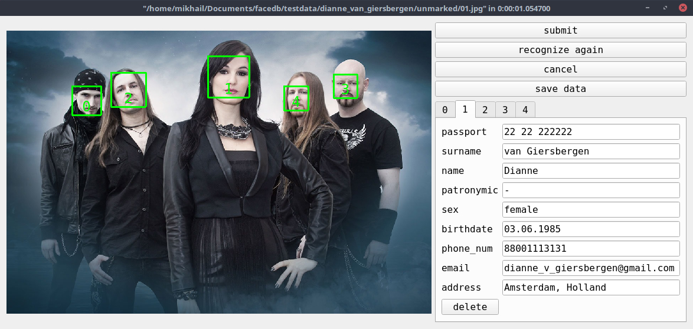
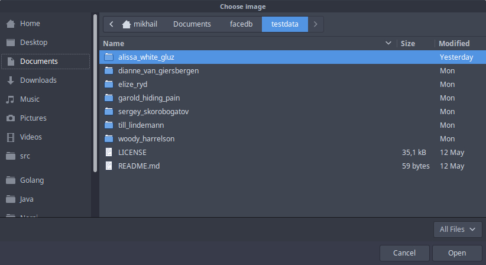

# controlpanel

**nofacedb/controlpanel** is a `GUI` client for **NoFaceDB** program complex.

## Tech

**controlpanel** uses a number of open source projects to work properly:
- [PyQT5](https://www.riverbankcomputing.com/software/pyqt/intro) - Python bindings for QT graphical framework;
- [AIOHTTP](https://aiohttp.readthedocs.io/en/stable/) - asynchronous HTTP library;

## Installation

**controlpanel** requires [Python](https://www.python.org/) v3.6+ to run.

Get **controlpanel** (and other microservices), install the dependencies from requirements.txt, and now You are ready to find faces!

```sh
$ git clone https://github.com/nofacedb/controlpanel
$ cd controlpanel
$ pip install -r requirements.txt
```
## Examples

Some screenshots:
- Start screen
  
- Processing image
  
- Choosing files to upload\
  

## Many thanks to:

- Igor Vishnyakov and Mikhail Pinchukov - my scientific directors;
